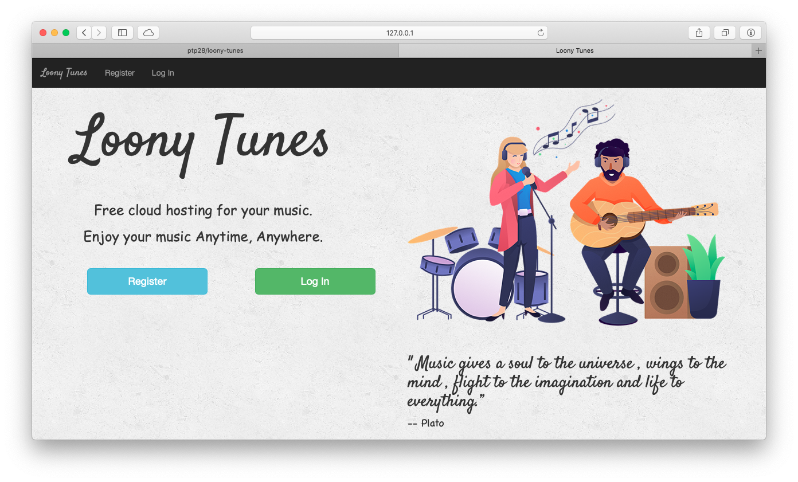
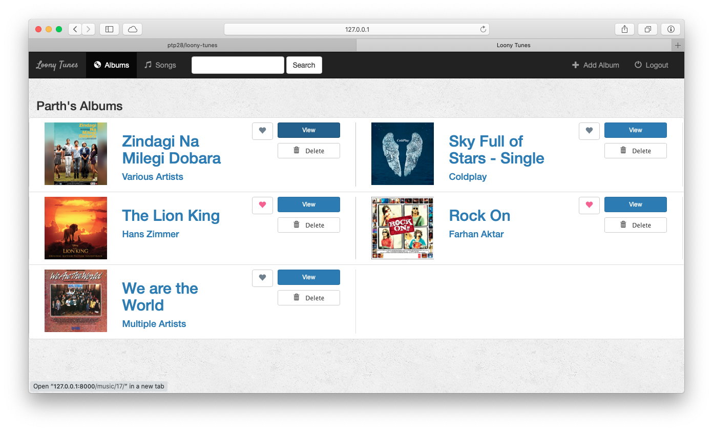
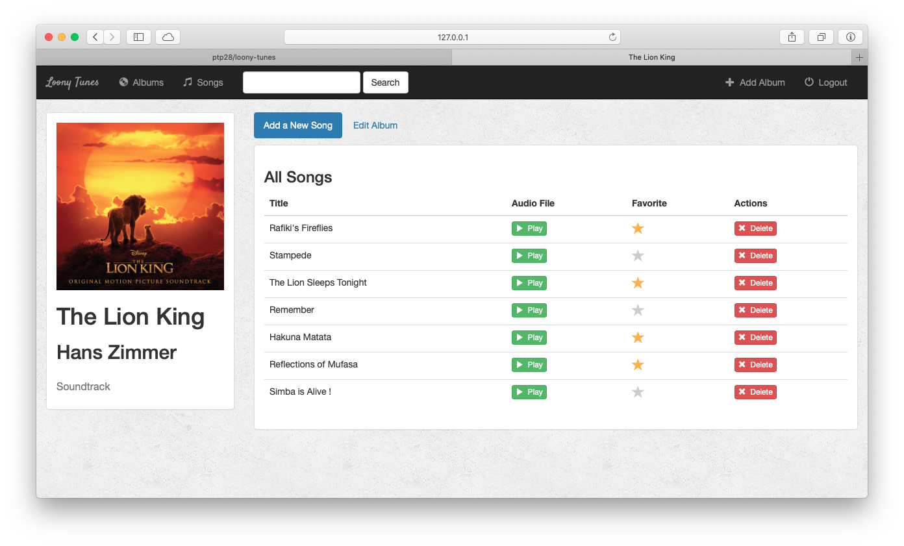
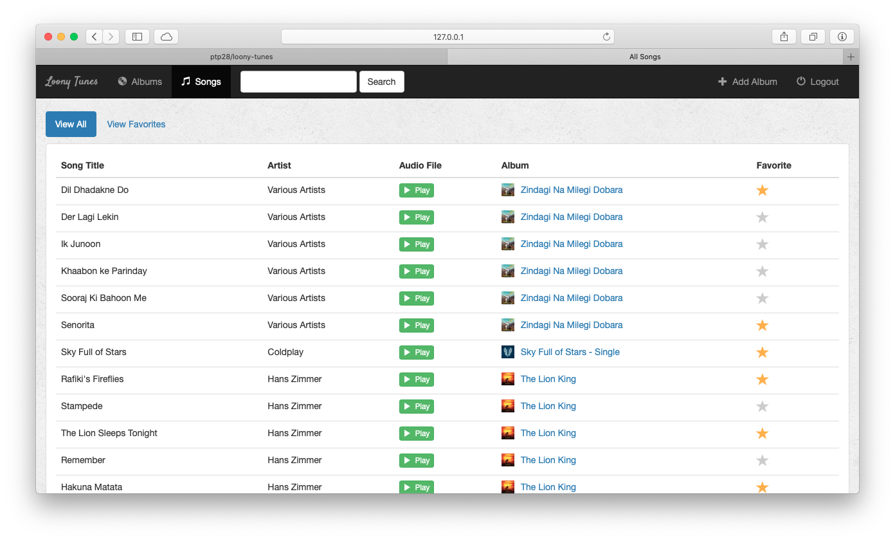
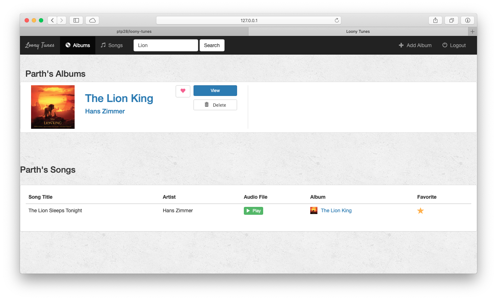

# What is [Loony Tunes](https://loonytunes.herokuapp.com)? 

Updated in 2022.

Part 2

Loony Tunes is an application that let's you upload, store, and play all of your music from the cloud. You can manage and listen to your music from any device, anywhere in the world.

## Albums View

 This is the main page you will see upon logging in. All your albums are displayed here in a neat grid with the album art, album name and artist. 
 
 You can add as many albums as you want. After you add an album, you will then be able to add/upload songs.

## Album Details

This is where details and songs of the selected album will be displayed. You can,
- add new songs to the album
- favourite a particular song
- delete songs from the album
- and also edit album info.

## Songs View

If you want to view a list of all songs instead albums.

## Searching

You can also search for music using the search feature at the top of every page. Any relevant albums will appear at the top of the results page, and the results for individual songs will appear below. 

## Responsive UI

You can use this site on any device, be it a phone or a PC. It has a responsive UI which adapts to the client's screen size.

## References

Based on thenewboston's and Bucky Robert's [Django tutorials](https://youtu.be/qgGIqRFvFFk).
